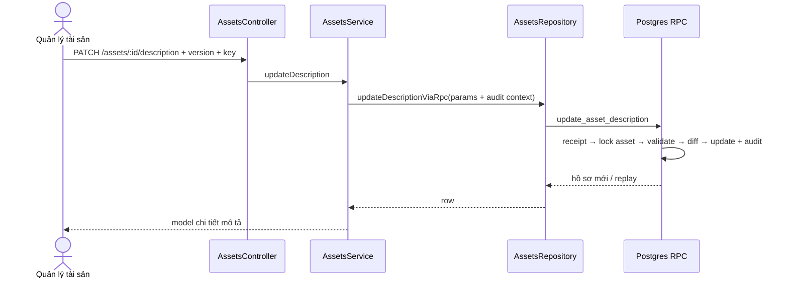

# UC-AST-03 — Sửa thông tin mô tả tài sản (kế hoạch backend)

## Phạm vi và contract

- `PATCH /v1/assets/:id/description`, chỉ `ASSET_MANAGER` ở PLATFORM, bắt buộc `Idempotency-Key`.
- Payload chỉ có `name`, `assetTypeId`, `serial`, `note`, `reasonCodeId?`, `reasonNote?`, `profileVersion`.
  Không nhận location, người chịu trách nhiệm, trạng thái, tình trạng hay trường tài chính.
- Migration 17 mở operation `UPDATE_DESCRIPTION` cho `asset_command_receipts` và tạo RPC
  `update_asset_description`. Không sửa migrations 01–16.

## Quy tắc

- Chặn `DISPOSED`, `CANCELLED`; schema hiện chưa có `LOST` nên không tự thêm.
- Loại mới phải là loại lá ACTIVE. Serial bắt buộc theo loại và duy nhất trong loại đối với hồ sơ chưa huỷ.
- `profile_version` lệch → `RECORD_VERSION_CONFLICT`; không có diff → `NO_CHANGES` (400).
- Lý do PROFILE_EDIT là tùy chọn. Khi `asset_kind` đổi `FIXED_ASSET ↔ TOOL`, lý do ACTIVE đúng nhóm là bắt
  buộc; mục freetext bắt buộc có ghi thêm. Audit `asset.description.updated` chỉ chứa trường đổi trước/sau.
- Idempotency receipt gắn actor + payload; replay không update/audit lần hai.
- Ảnh chưa có metadata/storage contract; phần ảnh được nối sau UC-AST-06 trong cùng batch M03, không lưu URL giả.

## TDD/review

- DTO chuẩn hoá blank, giới hạn độ dài, UUID/version.
- Service truyền đúng actor/audit/idempotency và map response.
- RPC review: lock/version, terminal state, validation loại/serial/lý do, no-op, diff allowlist, audit atomic,
  receipt replay và revoke/grant.

