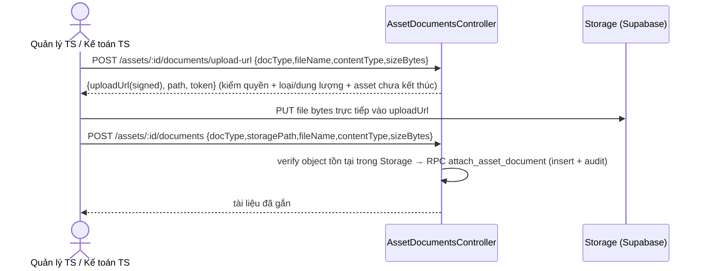

# UC-AST-06 — Đính kèm chứng từ tài sản (kế hoạch kỹ thuật backend)

> Tải hoá đơn/PO/biên bản/phiếu bảo hành/ảnh lên **kho tệp riêng tư** (Supabase Storage) rồi gắn vào hồ
> sơ. Tệp đi **thẳng từ trình duyệt vào Storage** (request tới server <256KB, không mang nội dung tệp).
> Xem qua **đường dẫn có thời hạn** do server cấp sau khi kiểm quyền. Nền cho UC-AST-04 (chứng từ căn cứ).

## 1. Hạ tầng Storage (migration 22)

- `insert into storage.buckets (id, name, public) values ('asset-documents','asset-documents', false)` —
  bucket **riêng tư** (idempotent). KHÔNG tạo policy cho anon/authenticated → deny-by-default; backend
  dùng `service_role` (bỏ qua RLS) + **signed URL** (token ký sẵn) cho upload/download.
- Bảng **`asset_documents`**: id, asset_id fk, doc_type (INVOICE/PO/HANDOVER/WARRANTY/PHOTO check),
  file_name, storage_path (unique), content_type, size_bytes, uploaded_by, uploaded_at, created_at.
  RLS bật (deny mặc định). Không xoá cứng (TBD-3: gỡ chứng từ để GĐ sau).
- RPC **`attach_asset_document`**: insert dòng + audit `asset.document.attached` nguyên tử; audit KHÔNG
  chứa signed URL (BR-AUD-02); chặn trạng thái kết thúc (EX.6). revoke/grant.

## 2. Luồng upload trực tiếp (3 bước, giữ request nhỏ)

- **upload-url:** kiểm quyền (platform ASSET_MANAGER/ASSET_ACCOUNTANT), asset tồn tại & chưa kết thúc,
  docType hợp lệ, contentType ∈ allowlist, sizeBytes ≤ max → `createSignedUploadUrl(path)`; path =
  `assets/<assetId>/<uuid>-<ten-tep-an-toan>`. EX.1 (sai loại/quá dung lượng) → 400.
- **confirm (POST documents):** verify object tồn tại (chống gắn path giả), RPC gắn + audit. EX.2/EX.6.

## 3. Allowlist & giới hạn [TBD-2] (mặc định, chờ Vận hành chốt)

- Loại tệp: `application/pdf`, `image/jpeg`, `image/png`, `image/webp`.
- Dung lượng: ≤ 10MB/tệp. (Số chứng từ tối đa/hồ sơ: chưa giới hạn.)

## 4. Đọc / hiển thị

- `GET /assets/:id/documents/:docId/url` → kiểm scope (ASSET_DETAIL_SCOPE) + **BR-CMN-06**: INVOICE/PO
  chỉ cấp cho vai trò xem tài chính (`canViewFinancial`); loại khác cho mọi người xem được chi tiết →
  `createSignedUrl(path, 60s)`. Không audit (chỉ đọc). Ngoài quyền → 403; ngoài scope → 404.
- **Danh sách chứng từ** nằm trong `GET /assets/:id` (UC-AST-08): `service.detail` lấy `asset_documents`,
  lọc BR-CMN-06, map (id, docType, fileName, uploadedByName, uploadedAt, canView) — **không** phơi
  storage_path hay signed URL. Thay thế `documents: []` placeholder hiện tại.

## 5. Phân quyền

- Upload (upload-url + confirm): platform `ASSET_MANAGER` **hoặc** `ASSET_ACCOUNTANT` (@RequireContext PLATFORM).
- Xem/ký URL: dùng `ASSET_DETAIL_SCOPE` ở service (giống UC-AST-08) + lọc tài chính.

## 6. Test (TDD)

- DTO: docType ngoài miền → VALUE_OUT_OF_DOMAIN; contentType ngoài allowlist / size quá max → lỗi.
- Service: ký upload-url gọi storage với path đúng; confirm gọi RPC đúng args; getDownloadUrl áp BR-CMN-06
  (INVOICE cho location manager → 403/ẩn); detail lọc tài liệu tài chính theo canViewFinancial.
- Repository error map.

## 7. Ngoài phạm vi / quyết định

- [TBD-3] gỡ chứng từ: chưa có (giữ nguyên, GĐ sau).
- [TBD-4] đính kèm cho tài sản đã kết thúc: chặn (BR-AST-07).
- [TBD-5] quyền xem theo loại: GĐ1 chỉ tách INVOICE/PO (tài chính) vs còn lại; tinh chỉnh sau.
- Audit chỉ ghi việc gắn (doc_type, file_name, doc_id), KHÔNG ghi signed URL (BR-AUD-02).
