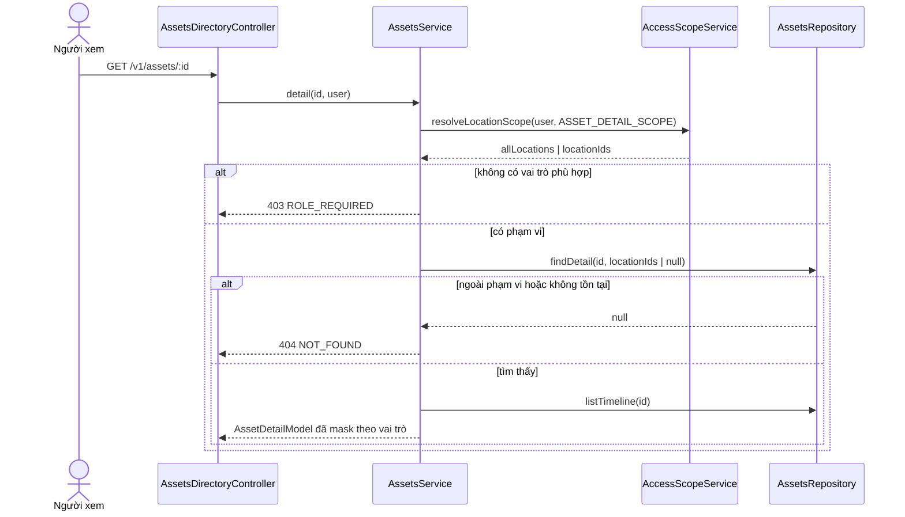

# UC-AST-08 — Xem hồ sơ chi tiết tài sản (kế hoạch backend)

> Luồng chỉ đọc. Không tạo migration mới, không ghi audit. Migrations 01–16 giữ nguyên.

## 1. Contract và luồng dữ liệu

- `GET /v1/assets/:id` trên `AssetsDirectoryController`; chỉ dùng `JwtAuthGuard`, còn quyền và biên location
  được kiểm tra tại service vì location thật nằm trong bản ghi tài sản, không nằm trong URL.
- `AssetsService.detail(id, req)` giải quyết `ASSET_DETAIL_SCOPE`, sau đó repository truy vấn tài sản bằng đồng
  thời `id` và tập `primary_location_id` được phép. ID không tồn tại và tài sản ngoài phạm vi cùng trả
  `NOT_FOUND`, không trả bất kỳ trường nào của tài sản.
- Sau khi tìm thấy tài sản, repository tải các danh mục tham chiếu và `audit_events` có
  `subject_type = 'Asset'`, `subject_id = id`. Timeline sắp cũ → mới theo câu “từ lúc tạo tới hiện tại” trong UC;
  chưa thêm bộ lọc khi TBD-3 chưa được chốt.

## 2. Quyền và bảo mật

- Vai trò toàn hệ thống: `ASSET_MANAGER`, `ASSET_ACCOUNTANT`, `CHIEF_ACCOUNTANT`, `EXECUTIVE`, `AUDITOR`.
- Vai trò theo địa điểm: `LOCATION_MANAGER`, chỉ đọc tài sản đang ghi tại địa điểm được gán.
- `financial` chỉ có với nhóm toàn hệ thống ở trên (và break-glass super admin); Location Manager nhận `null`.
  Giai đoạn hiện tại phần tài chính mới có `invoiceNo`; nguyên giá/giá trị còn lại sẽ được UC-AST-04 bổ sung.
- Không trả `qr_token`, địa chỉ IP, user-agent, request ID hay metadata nội bộ của audit.
- Timeline chỉ trả event code, người thực hiện, thời điểm, lý do và `changes` đã làm sạch. Với người không có
  quyền tài chính, các khóa tiền tệ bị loại đệ quy khỏi `changes` (defence-in-depth cho các UC sau).
- Trạng thái kết thúc hiện có trong schema là `DISPOSED`, `CANCELLED`; model trả `readOnly=true`. Giá trị `LOST`
  trong văn bản UC chưa tồn tại trong enum/schema nên không tự bổ sung.

## 3. Chứng từ và timeline

- Schema hiện chưa có bảng metadata chứng từ hoặc bucket contract; UC-AST-06 phụ trách đính kèm. Vì vậy response
  trả `documents: []` có chủ đích. Không dựng bảng/storage hoặc signed URL giả.
- Khi UC-AST-06 hoàn tất, endpoint này sẽ đọc metadata theo cùng scope; endpoint mở tệp phải kiểm tra lại quyền rồi
  mới tạo signed URL, và tuyệt đối không đưa URL vào audit (BR-AUD-02).
- Lỗi kho tệp trong tương lai không được làm hỏng phần hồ sơ/timeline; hiện chưa có lời gọi storage.

## 4. Model trả về

- Nhận diện: id, Asset ID, tên, serial, loại, ghi chú, trạng thái vòng đời, tình trạng vật lý, `readOnly`.
- Nghiệp vụ: ngày mua, nhà cung cấp, location, cost center, người chịu trách nhiệm, thời điểm tạo/cập nhật.
- `financial: { invoiceNo } | null` theo BR-CMN-06.
- `documents: []`; `timeline[]` theo thứ tự thời gian tăng dần.

## 5. TDD và kiểm chứng

- RED/GREEN service: không vai trò → 403 và không gọi repository; platform → scope `null` + có tài chính; Location
  Manager → truyền đúng location IDs + `financial:null`; ngoài scope → `NOT_FOUND` và không đọc timeline.
- Mapper: không phơi QR/nội bộ; timeline không tài chính bị loại các khóa tiền tệ; trạng thái kết thúc là read-only.
- Controller/repository: UUID route được validate; query tài sản áp scope trước khi tải timeline.
- Review tập trung vào IDOR, phân biệt 403/404, dữ liệu tài chính và trường audit nhạy cảm.
