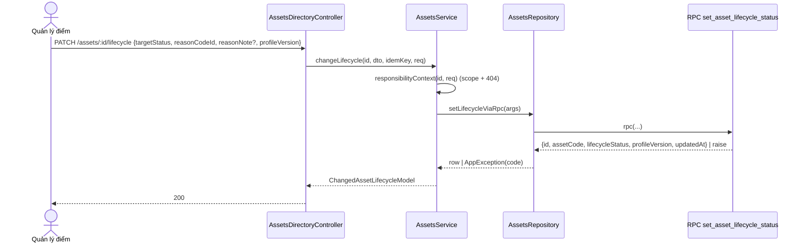
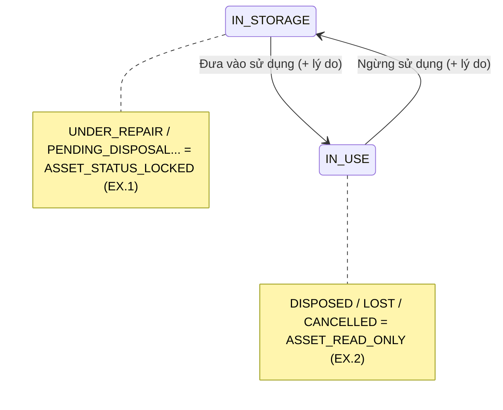

# UC-AST-11 — Đưa vào / ngừng sử dụng tài sản (kế hoạch kỹ thuật backend)

> Đổi tay trạng thái vòng đời **Lưu kho ↔ Đang sử dụng** kèm lý do. Không đổi location, người chịu
> trách nhiệm, cost center hay tình trạng vật lý (BR-AST-04). Ghi + audit nguyên tử. Tái dùng nguyên
> mẫu `change_asset_responsible` (UC-AST-05, migration 18).

## 1. Phạm vi

- RPC **`set_asset_lifecycle_status`** (migration 20): khóa asset `for update`, khóa lạc quan theo
  `profile_version`, chỉ cho chuyển giữa `IN_STORAGE` và `IN_USE`, bắt lý do nhóm `USE_STATUS_CHANGE`,
  idempotency qua `asset_command_receipts` (operation `CHANGE_LIFECYCLE`), audit `asset.lifecycle.changed`.
- **Không đụng CHECK `reason_group`:** migration 02g (QĐ-06) đã mở 22 nhóm, có sẵn `USE_STATUS_CHANGE`
  kèm mục 'Khác'. Migration 20 chỉ thêm operation `CHANGE_LIFECYCLE` cho receipt + RPC.
- Endpoint đọc lý do: `GET /v1/assets/:id/lifecycle-options` → `{ currentStatus, profileVersion, reasons }`.
- Route `PATCH /v1/assets/:id/lifecycle` trên `AssetsDirectoryController` (chỉ `JwtAuthGuard`; quyền +
  biên location ở service).
- DTO/model/repository/service + test TDD.

## 2. Phân quyền + biên dữ liệu

- Dùng lại `ASSET_RESPONSIBILITY_SCOPE` (platform `ASSET_MANAGER`; location `LOCATION_MANAGER`) và
  `responsibilityContext()` — đã kiểm: scope rỗng → 403 `ROLE_REQUIRED` (EX.5); asset ngoài phạm vi
  hoặc không tồn tại → **404 NOT_FOUND** (chống dò). Location lấy từ asset, không nhận từ client
  (BR-CMN-03/04).

## 3. Luồng (mermaid)

### Máy trạng thái (chỉ phần UC này chạm)

## 4. Hợp đồng RPC (bên trong transaction)

1. Insert receipt (command_key, actor, operation `CHANGE_LIFECYCLE`, payload) `on conflict do nothing`
   → replay trả `result_row` cũ (idempotency; payload khác key trùng → `IDEMPOTENCY_KEY_REUSED`).
2. `select ... for update` asset; không có → `ASSET_NOT_FOUND`.
3. Trạng thái kết thúc (`DISPOSED/LOST/CANCELLED`) → `ASSET_READ_ONLY` (EX.2).
4. Trạng thái không thuộc {`IN_STORAGE`,`IN_USE`} → `ASSET_STATUS_LOCKED` (EX.1).
5. `profile_version <> p_expected_version` → `RECORD_VERSION_CONFLICT` (EX.4).
6. `p_target_status` phải là trạng thái ĐỐI của hiện tại; bằng hiện tại → `NO_CHANGES`; ngoài
   {`IN_STORAGE`,`IN_USE`} → `ASSET_STATUS_LOCKED`.
7. Lý do: `reason_codes` ACTIVE nhóm `USE_STATUS_CHANGE`; freetext mà thiếu ghi chú → `REASON_INVALID` (EX.3).
8. `update assets set lifecycle_status=p_target_status, profile_version=profile_version+1, updated_at=now()`
   — **không** đụng location/responsible/cost_center/physical_condition (BR-AST-04).
9. Insert `audit_events` `asset.lifecycle.changed` (changes `{lifecycle_status:{before,after}}`), reason,
   metadata `{asset_code, reason_code_id}`; lỗi → `AUDIT_WRITE_FAILED` (EX.6, cả hai cùng rollback).
10. Ghi `result_row` + `completed_at` vào receipt; trả jsonb.

`revoke all ... from public, anon, authenticated; grant execute ... to service_role`;
`security definer set search_path = public, pg_temp`.

## 5. Mapper (BR-CMN-06)

`toChangedAssetLifecycleModel`: `{ id, assetCode, lifecycleStatus, profileVersion, updatedAt }`. Không
phơi qr_token/actor/IP/cột nội bộ.

## 6. Test (TDD)

- Service: scope rỗng → `ROLE_REQUIRED` (không gọi repo); asset ngoài scope → `NOT_FOUND`; happy path
  gọi RPC đúng args + map model.
- DTO: `targetStatus` ngoài {IN_STORAGE,IN_USE} → `VALUE_OUT_OF_DOMAIN`; `profileVersion` thiếu/`<1`/`>int4`
  → lỗi; `reasonCodeId` sai UUID → `INVALID_REFERENCE_ID`.
- Repository error map: RECORD_VERSION_CONFLICT / ASSET_READ_ONLY / ASSET_STATUS_LOCKED / REASON_INVALID /
  NO_CHANGES → đúng ErrorCode.

## 7. Quyết định / ngoài phạm vi

- **[TBD-2] danh mục lý do:** dùng nhóm `USE_STATUS_CHANGE` có sẵn từ 02g (hiện chỉ có mục 'Khác';
  seed thêm preset "Đưa ra sử dụng" / "Cất về kho" ở `seed-m03`). Vận hành chốt danh sách sau (UC-MDM-07).
- **[TBD-4] chống ghi đè:** khóa lạc quan `profile_version` (EX.4 → 409 `RECORD_VERSION_CONFLICT`).
- EX.1 nêu các trạng thái luồng khác (Chờ điều chuyển, Đang sửa...) — do module M06/M07 đặt; UC này chỉ
  chặn (ASSET_STATUS_LOCKED). Không tự thêm trạng thái mới vào enum.
