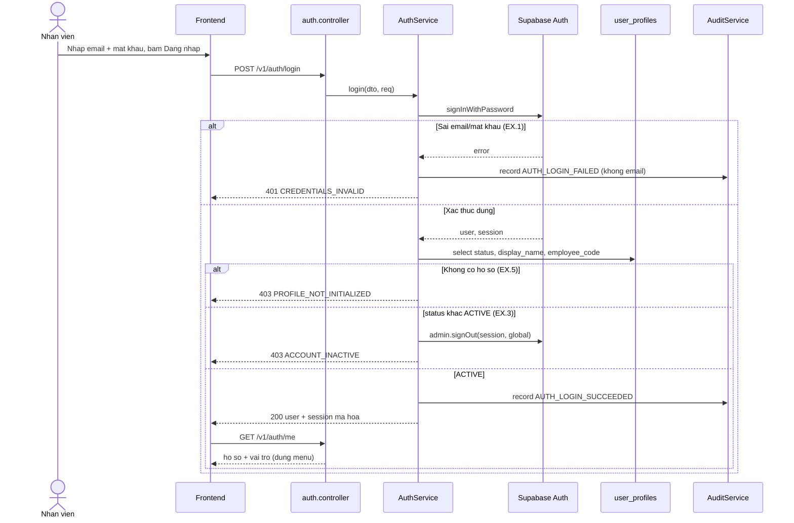
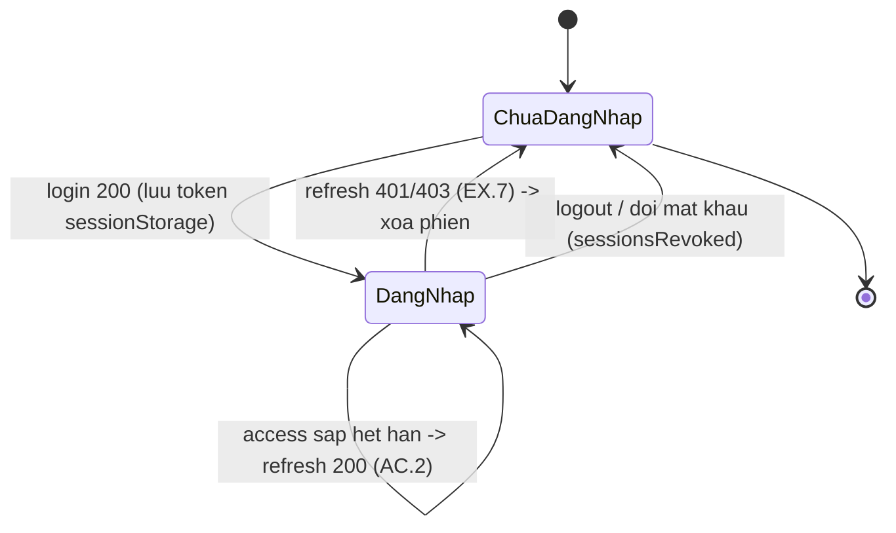

# Kế hoạch kỹ thuật backend — UC-IAM-01: Đăng nhập vào EH-AM

> **Yêu cầu 2 (backend).** Kế hoạch triển khai kỹ thuật cho [UC-IAM-01](../../product-usecase/M01-nguoi-dung-phan-quyen/UC-IAM-01_dang-nhap-vao-eh-am.md). Theo cấu trúc ecc:plan + tdd-workflow (xem bảng skill ở `CLAUDE.md`). Tính năng F-IAM-01.
>
> **Trạng thái:** luồng chính và phần lớn ngoại lệ **đã có sẵn** trong hạ tầng auth (`src/auth/`). Kế hoạch này (a) đối chiếu code hiện có với từng AC/EX, (b) chỉ ra và vá độ lệch an toàn (chỉ code), (c) đánh dấu độ lệch cần migration để Duy xử lý.

## 1. Phạm vi và bối cảnh kỹ thuật

- **Endpoint:** `POST /v1/auth/login` (đăng nhập), `POST /v1/auth/refresh` (AC.2 làm mới), `GET /v1/auth/me` (bước 9, UC-IAM-14).
- **Tầng:** `auth.controller.ts` -> `auth.service.ts` (`login`, `refreshSession`, `getAuthUser`) -> `SupabaseAuthService` (anon, xác thực) + `SupabaseAdminService` (service_role, đọc `user_profiles`) + `EncryptionService` (bọc AES-256-GCM token) + `AuditService`.
- **Biên bảo mật:** vai trò **không** nằm trong token; đọc `user_profiles.status` mỗi lần đăng nhập/làm mới để khoá tài khoản có hiệu lực ngay. Token trả client được mã hoá một lớp riêng (AES-GCM) vì refresh token gốc của Supabase dùng thẳng được với endpoint công khai.
- **Giới hạn tần suất:** mức `LOGIN` (chặt hơn API nghiệp vụ), đếm theo IP (một điểm bán thường chung một IP).

## 2. Sơ đồ trình tự (luồng chính + EX chính)

## 3. Sơ đồ trạng thái phiên (client)

## 4. Đối chiếu code hiện có với UC (conformance)

| Mục UC | Yêu cầu | Vị trí code | Trạng thái |
| --- | --- | --- | --- |
| Luồng chính 5–10 | Xác thực, đọc hồ sơ, kiểm ACTIVE, ghi audit, trả token mã hoá; `/me` lấy vai trò | `auth.service.ts login()`, `getAuthUser()` | Đã có |
| AC.2 làm mới | `refresh` giải mã, đổi token, kiểm status, trả cặp mới | `refreshSession()` | Đã có |
| EX.1 sai thông tin | 401 CREDENTIALS_INVALID, một câu, audit không email | `login()` nhánh error | Đã có |
| EX.2 nhập không hợp lệ | 400 VALIDATION_FAILED theo ô | `LoginDto` + ValidationPipe | Đã có |
| EX.3 khoá/ngừng | 403 ACCOUNT_INACTIVE **và thu hồi phiên vừa tạo** | `login()` nhánh status | Thiếu thu hồi (vá §5) |
| EX.4 quá tần suất | 429 TOO_MANY_REQUESTS | `@Throttle(LOGIN)` | Đã có |
| EX.5 chưa có hồ sơ | 403 PROFILE_NOT_INITIALIZED | `login()` nhánh `!profile` | Đã có |
| EX.6 auth lỗi/timeout | 401 SESSION_CREATE_FAILED / 408 | `login()` + mapper | Đã có |
| EX.7 làm mới hỏng | 401 REFRESH_TOKEN_INVALID / 403, thu hồi khi không ACTIVE | `refreshSession()` | Đã có |
| AC.1 mật khẩu tạm | Trạng thái Chờ kích hoạt + cờ mật khẩu tạm + PASSWORD_CHANGE_REQUIRED (403) + 3 route được phép | — | Cần migration (§6) |
| EX.8 mật khẩu tạm gọi route khác | 403 PASSWORD_CHANGE_REQUIRED | — | Cần migration (§6) |

## 5. Độ lệch chỉ-code cần vá — EX.3 thu hồi phiên (làm phiên này, TDD)

**Vấn đề:** `login()` khi `profile.status !== 'ACTIVE'` ném `ACCOUNT_INACTIVE` nhưng **không** thu hồi phiên `signInWithPassword` vừa tạo ở Supabase. Token không tới trình duyệt nhưng phiên vẫn sống ở Dịch vụ xác thực. `refreshSession()` đã thu hồi trong tình huống tương ứng — hai nhánh lệch nhau. UC-IAM-01.EX.3 yêu cầu "thu hồi phiên vừa tạo".

**Cách vá (bám đúng mẫu đã có ở `refreshSession`):** trước khi ném `ACCOUNT_INACTIVE`, gọi `supabaseAdminService.client.auth.admin.signOut(session.access_token, 'global')`; lỗi thu hồi chỉ log mức `error`, không ném (đăng nhập đã bị từ chối, không được che lỗi chính).

**TDD:** thêm `src/auth/auth.service.spec.ts` (chưa có unit spec cho service này). Test RED: `login` với hồ sơ `SUSPENDED` phải gọi `admin.signOut` bằng access token của phiên vừa tạo **và** vẫn ném `ACCOUNT_INACTIVE`.

Không đụng nhánh `PROFILE_NOT_INITIALIZED` (EX.5): giữ đồng nhất với `refreshSession` (nhánh profile-missing ở đó cũng không thu hồi). Nếu Duy muốn thu hồi cả EX.5, mở một thay đổi riêng.

## 6. Độ lệch cần migration — AC.1 / EX.8 (KHÔNG làm khi vắng Duy)

AC.1 (đăng nhập lần đầu bằng mật khẩu tạm) và EX.8 cần:

1. Migration thêm trạng thái `PENDING_ACTIVATION` vào cột status của `user_profiles` (hiện chỉ ACTIVE/SUSPENDED/DEACTIVATED) và một cờ "mật khẩu tạm".
2. Mã lỗi mới `PASSWORD_CHANGE_REQUIRED` (403) trong `error-code.const.ts`.
3. Guard chặn phiên mật khẩu tạm chỉ gọi được 3 route (đổi mật khẩu, đăng xuất, `/me`) theo QĐ-14, BR-IAM-14/21.

Đây là thay đổi schema; migration chạy tay trong Supabase và cần Duy. Ghi lại để làm cùng UC-IAM-05 (tạo mật khẩu tạm) và UC-IAM-04 (đổi mật khẩu), vì ba UC gắn nhau. **Không thêm khi chưa có migration được chạy và Duy chưa duyệt.**

## 7. Kế hoạch kiểm thử

- **Unit (TDD, phiên này):** `auth.service.spec.ts` — nhánh EX.3 thu hồi phiên (mock `SupabaseAuthService`, `SupabaseAdminService`, `AuditService`, `I18nService`). Đây cũng là bộ khung unit-test đầu tiên cho `AuthService`, dùng lại cho các UC auth sau.
- **Contract (offline, đã có):** `test/auth-contract.e2e-spec.ts` — hình dạng lỗi, định tuyến, validation, throttling. `npm run test:e2e -- auth-contract`.
- **Flow (Supabase thật, cần Duy):** `test/auth-flow.e2e-spec.ts` — tự skip trừ khi có credential thật và `SMOKE_TEST_ALLOW_WRITES=true`.
- **Manual test (cổng Yêu cầu 3):** Duy đăng nhập ở `http://localhost:5175/sign-in` bằng tài khoản thật; kiểm: vào đúng trang vai trò; sai mật khẩu ra một câu; tài khoản khoá ra ACCOUNT_INACTIVE; làm mới phiên hoạt động.

## 8. Kiểm chứng trước khi báo xong

`npx tsc --noEmit` · `npx eslint src test` · `npm test` (unit) · `npm run test:e2e -- auth-contract`. Tất cả xanh. Không commit (chờ Duy).
