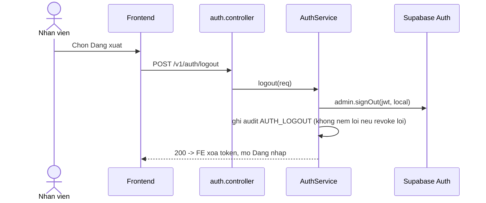

# Kế hoạch kỹ thuật backend — UC-IAM-02: Đăng xuất khỏi EH-AM

> **Yêu cầu 2 (backend).** UC: [UC-IAM-02](../../product-usecase/M01-nguoi-dung-phan-quyen/UC-IAM-02_dang-xuat-khoi-eh-am.md). Tính năng F-IAM-01. Theo ecc:plan + tdd-workflow (xem `CLAUDE.md`).
>
> **Trạng thái: đã có sẵn, KHÔNG có độ lệch với code** (theo ghi chú của UC). Kế hoạch này là bản đối chiếu + trỏ test.

## 1. Endpoint và tầng
- `POST /v1/auth/logout` → `AuthService.logout` — thu hồi phiên **một thiết bị** (`admin.signOut(jwt, 'local')`), ghi audit `AUTH_LOGOUT`, không ném lỗi nếu thu hồi lỗi (ý định đăng xuất đã đạt).
- `POST /v1/auth/logout-all` → `AuthService.logoutAllSessions` — thu hồi **mọi** phiên (`'global'`), ghi audit `AUTH_ALL_SESSIONS_REVOKED`; nhánh này CÓ ném lỗi (khác logout một thiết bị).

## 2. Sơ đồ trình tự

## 3. Đối chiếu UC
| Mục | Vị trí code | Trạng thái |
| --- | --- | --- |
| Luồng chính (thu hồi 1 thiết bị) | `logout()` scope `'local'` | Đã có |
| AC.1 đăng xuất mọi thiết bị | `logoutAllSessions()` scope `'global'` | Đã có |
| EX.1 phiên hết hạn | JwtAuthGuard chặn trước / FE xoá token | Đã có |
| EX.2 thu hồi lỗi vẫn coi là xong | `logout()` chỉ log warn | Đã có |
| EX.3 logout-all lỗi thì báo ra | `logoutAllSessions()` `mapSupabaseAuthError` | Đã có |
| EX.4/EX.6 timeout | mapper + FE | Đã có |
| EX.5 quá tần suất | `@Throttle(AUTH)` | Đã có |

## 4. Test
- Contract offline: `npm run test:e2e -- auth-contract` (đã xanh 55/55, gồm định tuyến/guard logout).
- Manual: đăng xuất trên máy dùng chung, kiểm phiên không dùng lại được; "đăng xuất mọi thiết bị" có xác nhận.
- Không có độ lệch cần vá.
