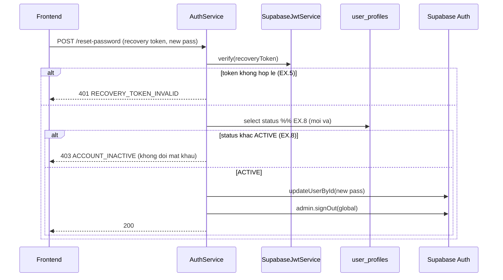

# Kế hoạch kỹ thuật backend — UC-IAM-03: Đặt lại mật khẩu khi quên

> **Yêu cầu 2 (backend).** UC: [UC-IAM-03](../../product-usecase/M01-nguoi-dung-phan-quyen/UC-IAM-03_dat-lai-mat-khau-khi-quen.md). Tính năng F-IAM-02.
>
> **Trạng thái: đã có sẵn, đã VÁ một độ lệch (EX.8) trong phiên này bằng TDD.**

## 1. Endpoint và tầng
- `POST /v1/auth/forgot-password` → `forgotPassword` — luôn trả một câu chung (chống dò tài khoản, BR-IAM-07), ghi audit một dòng/lần gọi.
- `POST /v1/auth/reset-password` → `resetPassword` — verify mã khôi phục (JWKS), **kiểm hồ sơ ACTIVE (mới vá)**, đặt mật khẩu mới, thu hồi mọi phiên, ghi audit.

## 2. Sơ đồ trình tự (reset)

## 3. Độ lệch đã vá (phiên này, TDD)
**UC-IAM-03.EX.8:** `reset-password` trước đây không kiểm trạng thái hồ sơ nên tài khoản Tạm khoá/Đã ngừng vẫn đặt lại được mật khẩu. Đã thêm bước đọc `user_profiles.status`, không ACTIVE thì trả `ACCOUNT_INACTIVE` (403) và **không** đổi mật khẩu. Test: `auth.service.spec.ts` → describe `resetPassword` (RED→GREEN).

Độ lệch còn lại (không bắt buộc): `forgot-password` dùng client dùng chung thay vì client dùng một lần — chỉ là đồng bộ phong cách, không ảnh hưởng UC. Chưa đổi.

## 4. Đối chiếu UC (tóm tắt)
EX.1 validation, EX.2 email không tồn tại/không hoạt động → câu chung, EX.3 tần suất, EX.4 timeout, EX.5 token hỏng, EX.6 mật khẩu yếu, EX.7 lỗi sau khi đã đổi (không rollback), **EX.8 đã vá**. Tất cả có trong code.

## 5. Test
Unit: `auth.service.spec.ts` (reset ACTIVE/SUSPENDED). Contract: auth-contract 55/55. Manual: quên mật khẩu → nhận thư → đặt lại; thử với tài khoản bị khoá → bị từ chối.
