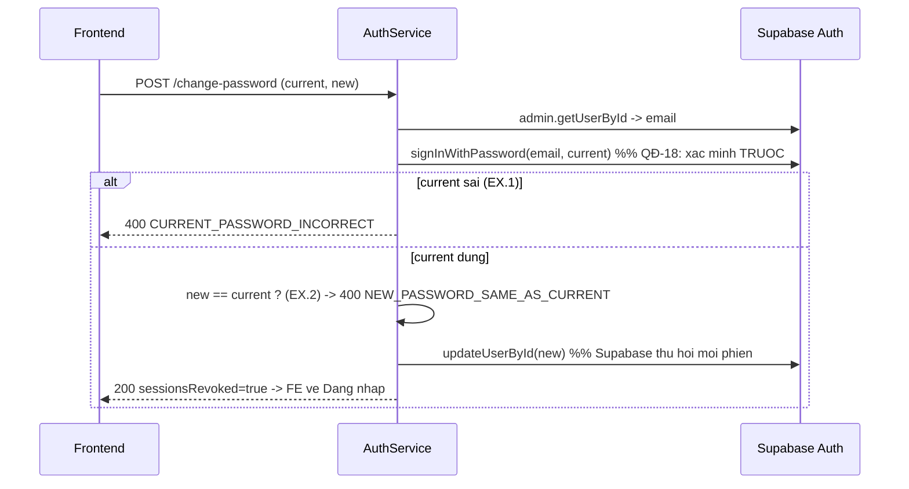

# Kế hoạch kỹ thuật backend — UC-IAM-04: Đổi mật khẩu đang dùng

> **Yêu cầu 2 (backend).** UC: [UC-IAM-04](../../product-usecase/M01-nguoi-dung-phan-quyen/UC-IAM-04_doi-mat-khau-dang-dung.md). Tính năng F-IAM-02.
>
> **Trạng thái: đã có sẵn, đã VÁ thứ tự kiểm tra (QĐ-18) bằng TDD. Phần mật khẩu tạm cần migration → hoãn.**

## 1. Endpoint và tầng
`POST /v1/auth/change-password` → `changePassword`: đọc email → **xác minh mật khẩu hiện tại bằng đăng nhập thử (trước)** → **kiểm mật khẩu mới trùng cũ (sau)** → đặt mật khẩu mới → ghi audit. Supabase tự thu hồi mọi phiên khi đổi mật khẩu (backend không gọi thêm `admin.signOut`).

## 2. Sơ đồ trình tự

## 3. Độ lệch đã vá (phiên này, TDD)
**QĐ-18 / UC-IAM-04.EX.1-EX.2:** trước đây code kiểm "mật khẩu mới trùng cũ" **trước** khi xác minh mật khẩu hiện tại → lộ thông tin cho người chưa chứng minh biết mật khẩu cũ, và trả nhầm mã lỗi. Đã đảo thứ tự: xác minh hiện tại trước, rồi mới kiểm trùng. Test: `auth.service.spec.ts` → describe `changePassword` (RED→GREEN).

## 4. Độ lệch cần migration (HOÃN, cần Duy)
**AC.1/AC.2 mật khẩu tạm** cần: trạng thái `PENDING_ACTIVATION`, cờ "phải đổi mật khẩu", mã lỗi `PASSWORD_CHANGE_REQUIRED` (403), guard chặn 3-route (BR-IAM-14/21, QĐ-14). Đây là thay đổi schema — làm cùng UC-IAM-05/UC-IAM-06 khi Duy chạy migration. Xem thêm plan UC-IAM-01 §6. **Không tự thêm khi chưa có migration.**

## 5. Test
Unit: `auth.service.spec.ts` (current sai + new trùng, current đúng + new trùng). Contract: 55/55. Manual: đổi mật khẩu → bị đăng xuất mọi thiết bị → đăng nhập lại bằng mật khẩu mới.
