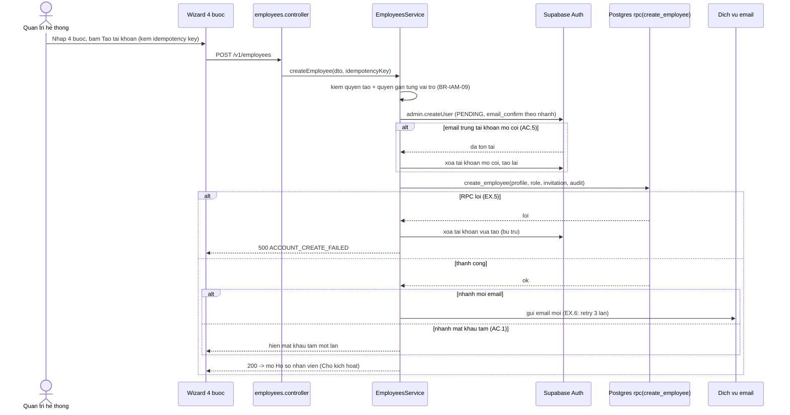

# Kế hoạch kỹ thuật backend — UC-IAM-05: Thêm nhân viên mới

> **Yêu cầu 2 (backend) — bản để Duy duyệt TRƯỚC khi build.** UC: [UC-IAM-05](../../product-usecase/M01-nguoi-dung-phan-quyen/UC-IAM-05_them-nhan-vien-moi.md). Tính năng F-IAM-03. Theo ecc:plan + tdd-workflow.
>
> **Trạng thái: chưa dựng. Cần migration MỚI và có phụ thuộc chặn vào M02. Chưa viết code, chưa viết migration runnable — chờ Duy chốt các quyết định ở §5–§6.**

## 1. Phát hiện quan trọng — phụ thuộc M02 (đang chặn)

UC-IAM-05 (tiền điều kiện 2) cần danh mục nền của **M02**: location đang hoạt động (UC-MDM-01), phòng ban (UC-MDM-08), mục lý do nhóm gán vai trò (UC-MDM-07).

Migration `01_identity_rbac_audit.sql` (392 dòng) **chỉ có** `user_profiles`, `context_role_assignments`, `audit_events`. Nó **không** có bảng `locations`, `departments`, `reasons` — chính comment trong migration 01 ghi: `context_id` không đặt FK tới bảng location "vì bảng đó thuộc module danh mục" (chưa làm).

Kết luận: **không build được UC-IAM-05 trước khi có nền M02** (không có bảng để tham chiếu location/phòng ban/lý do). Đây là phụ thuộc thật, khớp thứ tự M01–M04 của blueprint.

**Khuyến nghị thứ tự (xem §6):** làm nền M02 (locations, departments, reasons) trước, rồi mới UC-IAM-05.

## 2. Tổng quan kỹ thuật UC-05

- **Wizard 4 bước ở client** (Đơn vị công tác → Thông tin cá nhân → Chi tiết công việc → Tài khoản và vai trò), kiểm từng bước ở trình duyệt bằng danh mục đã tải (QĐ-17), **chỉ gửi một lệnh ở bước cuối** kèm khoá chống trùng (idempotency, QĐ-01).
- **Một lệnh tạo, nguyên tử** (BR-IAM-09): hồ sơ (Chờ kích hoạt) + dòng vai trò ban đầu + lời mời + dòng nhật ký **cùng thành công hoặc cùng không có** → dùng **một hàm Postgres gọi qua `rpc()`** (giống định hướng của repo cho thao tác có hệ quả). Phần tài khoản ở Supabase Auth không nằm trong transaction DB nên dùng **bù trừ khi lỗi** (xoá tài khoản vừa tạo) như `register` đang làm.
- **Hai nhánh kích hoạt:** (a) mời qua email (mặc định, không ai biết mật khẩu); (b) mật khẩu tạm cho người không có email công việc (AC.1) — đặt cờ phải đổi mật khẩu, hiện mật khẩu tạm một lần, không lưu dạng đọc được.
- **Dọn tài khoản mồ côi** (AC.5): email trùng tài khoản Auth mà không có hồ sơ/vai trò/lời mời → coi là rác lần tạo lỗi trước, xoá và tạo lại.
- Route `POST /v1/auth/register` (đăng ký công khai) **được thay** bằng lệnh này; D-01 đề xuất đóng đăng ký công khai (chờ Q-19).

## 3. Sơ đồ trình tự (lệnh tạo ở bước cuối)

## 4. Thiết kế schema (đề xuất — chưa viết file runnable)

### 4a. Cần từ M02 (làm trước, migration riêng)
- `locations` (id, name, type ∈ cửa hàng/kho/xưởng rang/văn phòng, status, …).
- `departments` (id, name, location_id? hoặc theo location văn phòng, status).
- `reasons` (id, group ∈ {gán vai trò, …}, label, status) — danh mục lý do (BR-CMN-10).

### 4b. Bổ sung cho M01 account-management (migration này)
- `user_profiles` thêm cột: `phone`, `job_title`, `primary_location_id` (FK `locations`), `department_id` (FK `departments`, null khi location không phải văn phòng — QĐ-13), `manager_id` (FK `user_profiles` self, BR-IAM-12 chống vòng lặp), `employment_type`, `start_date`, `profile_version` (int, cho khoá lạc quan ở UC-IAM-08), `must_change_password` (bool, mặc định false).
- `user_profiles.status` CHECK **thêm `'PENDING_ACTIVATION'`** (hiện chỉ ACTIVE/SUSPENDED/DEACTIVATED).
- Bảng mới `invitations` (id, user_id FK, token_hash, status ∈ {SENT, ACCEPTED, EXPIRED, REVOKED}, expires_at, created_by, created_at) — token lưu **hash**, không lưu token thô; single-use + hết hạn (BR-IAM-14).
- Hàm `create_employee(...)` (plpgsql, `security definer`) ghi profile + role assignment + invitation + audit trong một transaction; trả id.
- Theo quy tắc migration của repo: idempotent, bật RLS mặc định từ chối, `tg_append_only` cho bảng lịch sử (invitations không phải lịch sử → được update status), không FK `on delete` lên cột người thực hiện của bảng lịch sử.

### 4c. Mã lỗi mới (ở code, không phải migration)
`PASSWORD_CHANGE_REQUIRED` (403), `EMAIL_ALREADY_REGISTERED` (409), `ROLE_NOT_ASSIGNABLE` (403), `INVALID_SUPERIOR` (400), `REASON_INVALID` (400), `EMAIL_SEND_FAILED` (502) — thêm vào `error-code.const.ts`.

## 5. Quyết định cần Duy chốt trước khi viết migration + build

1. **Tên nhóm API:** blueprint §14.1 ghi `/v1/employees` + `/v1/org-chart`, §19 ghi `/v1/users`. Cần thống nhất một tên. **Đề xuất: `/v1/employees`** (đúng ngôn ngữ nghiệp vụ, khớp §14.1).
2. **D-01 (Q-19):** đóng `POST /v1/auth/register` công khai và thay bằng lệnh tạo của admin? **Đề xuất: đóng** (công cụ nội bộ, không cần tự đăng ký).
3. **Lời mời hiệu lực bao lâu** (TBD-3) và **số lần retry email** (TBD-6) — đề xuất 72 giờ / 3 lần (giá trị mặc định để viết test, chờ xác nhận).
4. **SYSTEM_ADMIN được gán những vai trò nào ở bước 9** (TBD-5) — đề xuất mọi vai trò trừ SYSTEM_ADMIN (BR-IAM-05).
5. **Danh mục vai trò thật:** `role.enum.ts` hiện có 4 mã tạm; cần chốt bộ 9 vai trò của blueprint trước khi gán được.

## 6. Thứ tự triển khai khuyến nghị

1. **Nền M02** (migration 02: `locations`, `departments`, `reasons` + RLS; và UC-MDM-01/07/08 CRUD) — foundation, đơn giản hơn, và UC-05 cần nó.
2. **Migration 03**: bổ sung `user_profiles` + `invitations` + `PENDING_ACTIVATION` + hàm `create_employee` (theo §4b).
3. **Module UC-IAM-05** (`employees`): controller + service + repository + DTO + model + RPC, theo TDD.
4. Cùng lúc mở được **UC-IAM-01.AC.1 / UC-IAM-04.AC.1-AC.2** (mật khẩu tạm) vì đã có `PENDING_ACTIVATION` + `must_change_password`.

## 7. Kế hoạch test (TDD, khi build)

- Unit: validate DTO từng ô (bảng ràng buộc ở Ghi chú UC), chuẩn hoá email/mã NV/điện thoại; service kiểm quyền + trùng email/mã NV + cấp trên hợp lệ; nhánh bù trừ khi RPC lỗi; idempotency.
- Hàm Postgres `create_employee`: test nguyên tử (một phần lỗi → không còn gì).
- e2e: `POST /v1/employees` hình dạng lỗi (EX.1–EX.7), cần Supabase thật cho luồng đầy đủ.

## 8. Việc chờ Duy

Chốt §5 (nhất là tên API + đóng register + bộ vai trò) và §6 (làm M02 trước). Sau khi chốt, em viết migration runnable (02 + 03) để Duy chạy, rồi build module theo TDD và dừng ở cổng manual test.
