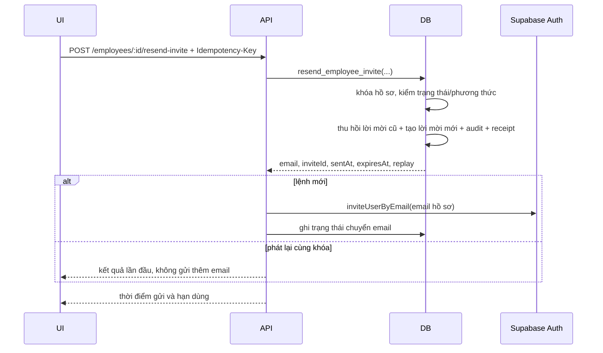

# UC-IAM-07 — Gửi lại lời mời kích hoạt (Backend)

## Mục tiêu

Cho phép Quản trị hệ thống gửi một lời mời kích hoạt mới cho nhân viên đang ở trạng thái `PENDING_ACTIVATION` và được tạo bằng lời mời email. Lời mời cũ bị thu hồi trong cùng giao dịch tạo lời mời mới và ghi audit.

## API và phân quyền

- `POST /v1/employees/:id/resend-invite`
- Guard: JWT + `SYSTEM_ADMIN` ở phạm vi `PLATFORM`.
- Header bắt buộc: `Idempotency-Key` UUID.
- Throttle: `THROTTLE_EMAIL` theo IP.
- Route công khai `POST /v1/auth/resend-confirmation` được đóng.

## Dòng xử lý

## Dữ liệu và tính nhất quán

- Migration mới `07_resend_activation_invite.sql`; không sửa migration 01–06.
- Mở rộng `employee_command_receipts.operation` cho `RESEND_INVITE`, thêm trạng thái chuyển email để phát lại an toàn.
- RPC `resend_employee_invite` chạy `SECURITY DEFINER`, khóa hồ sơ đích, xác nhận tài khoản vẫn chờ kích hoạt, không dùng mật khẩu tạm và đã có lời mời email.
- RPC thu hồi các lời mời cũ, tạo lời mời `SENT`, ghi đúng một audit event và hoàn tất receipt trong một transaction.
- Token/hash/link không xuất hiện trong response, audit hoặc log. Email luôn lấy từ hồ sơ.
- RPC bị revoke khỏi `public`, `anon`, `authenticated`; chỉ grant `service_role`.
- Gửi email xảy ra sau khi transaction đã commit. Nếu nhà cung cấp lỗi, lời mời mới vẫn được giữ và API trả `EMAIL_SEND_FAILED` (502). Số lần tự retry còn TBD nên UC này chỉ gọi nhà cung cấp một lần.
- Receipt cùng khóa trả lại kết quả lần đầu và tuyệt đối không gửi email/audit lần hai. Trạng thái chuyển email `PENDING` sau sự cố giữa chừng được coi là kết quả chưa chắc chắn và trả `REQUEST_TIMEOUT`.

## TDD và kiểm chứng

- Service: thành công, replay không gửi lại, xung đột trạng thái, email lỗi vẫn ghi `FAILED`, receipt `PENDING` trả timeout.
- Repository: map lỗi RPC sang `ACCOUNT_STATE_CONFLICT`, cập nhật trạng thái chuyển email.
- Controller/contract: đúng guard, throttle, idempotency; route public cũ trả 404.
- Chạy `npm test`, `npm run lint`, `npm run build` và kiểm migration bằng review SQL.
