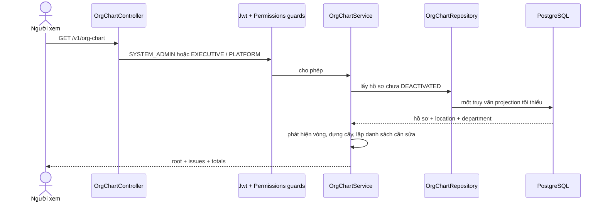
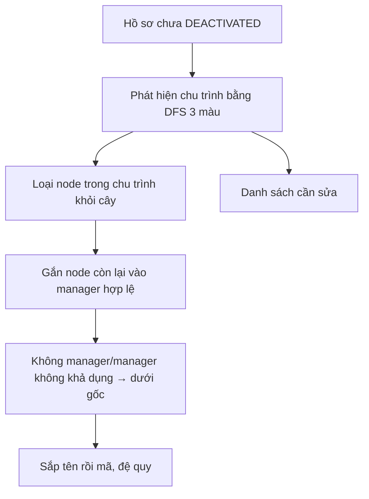

# UC-IAM-09 — Xem sơ đồ tổ chức (Backend)

## Phạm vi

`GET /v1/org-chart` trả một ảnh chụp chỉ đọc của cơ cấu nhân sự cho
`SYSTEM_ADMIN` và `EXECUTIVE` ở phạm vi `PLATFORM`. Endpoint không ghi dữ liệu,
không ghi audit và tuyệt đối không trả email/số điện thoại.

## Luồng kỹ thuật

## Hợp đồng dữ liệu

- Gốc ảo cố định: `Every Half`.
- Node: `id`, `displayName`, `employeeCode`, `jobTitle`, `status`, location,
  department và `children`; không có PII liên hệ.
- Loại khỏi cây: `DEACTIVATED`.
- Giữ trên cây và gắn trạng thái: `PENDING_ACTIVATION`, `SUSPENDED`.
- Người không có cấp trên nằm ngay dưới gốc.
- Người có `manager_id` trỏ tới hồ sơ không còn trong tập đọc được nằm dưới gốc
  và được đánh dấu `MANAGER_UNAVAILABLE`.
- Mọi thành viên thuộc một chu trình cấp trên bị tách khỏi cây, đưa vào danh sách
  cần sửa với `MANAGER_CYCLE`; phần cây còn lại vẫn trả bình thường.
- Nhân viên `ACTIVE` thiếu cấp trên hoặc thiếu đơn vị công tác nằm trong danh
  sách cần sửa. Đơn vị công tác hợp lệ là location chính; riêng location OFFICE
  còn cần department.

## Bảo mật và hiệu năng

- Guard kép JWT + role platform; super admin dùng cơ chế bypass hiện hữu.
- Repository chỉ chọn các cột phục vụ màn hình; mapper tạo DTO camelCase.
- Một lần đọc toàn bộ theo giả định UC; chưa phân trang theo nhánh cho tới khi
  pilot trả lời TBD-2.
- Không migration: các khóa `manager_id`, `primary_location_id`,
  `department_id` đã có từ migration 03.

## TDD

1. RED: dựng đúng cây và loại người đã ngừng.
2. RED: giữ nhãn chờ kích hoạt/tạm khóa, không làm lộ email/số điện thoại.
3. RED: phát hiện chu trình, không đệ quy vô hạn và vẫn giữ phần cây lành.
4. RED: liệt kê đúng người ACTIVE thiếu cấp trên/đơn vị.
5. RED: controller chỉ cho hai vai trò platform và route sai quyền trả 403.

## Quyết định phụ thuộc UC-IAM-08

UC-09 chỉ dựng và xem cây. Thao tác sửa cấp trên/đơn vị vẫn thuộc UC-IAM-08;
giao diện UC-09 không tạo API ghi thay thế. Thẻ quản trị dẫn về màn danh sách
nhân viên với từ khóa chính xác cho tới khi màn hồ sơ chỉnh sửa UC-IAM-08 tồn
tại, tránh tạo liên kết chết hoặc âm thầm mở rộng quyền ghi.
