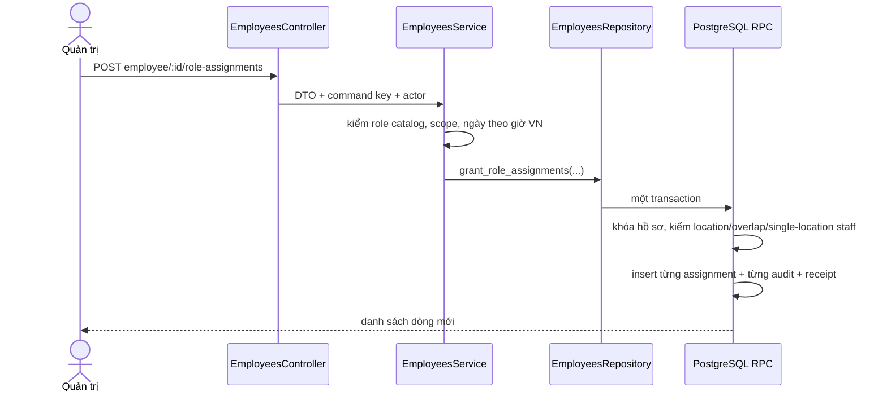

# UC-IAM-10 — Gán vai trò theo phạm vi (Backend)

## API

- `GET /v1/employees/:id/access`: hồ sơ tối thiểu, các dòng vai trò lịch sử và
  options đang hoạt động cho dialog.
- `POST /v1/employees/:id/role-assignments`: `SYSTEM_ADMIN/PLATFORM`, nhận
  `Idempotency-Key`, role, danh sách location (nếu role LOCATION), ngày hiệu lực
  và lý do.

## Migration 08

- Không sửa migration 01 đã chạy.
- Thêm bảng receipt idempotency riêng cho lệnh phân quyền.
- RPC `grant_role_assignments` chỉ cấp role `assignable`, không nhận
  `SYSTEM_ADMIN`; role code/context thật được backend đối chiếu lại trước khi gọi.
- RPC khóa hồ sơ đích và các dòng liên quan, chặn mọi khoảng hiệu lực chồng lấn
  bằng điều kiện range; multi-location là all-or-nothing.
- `LOCATION_STAFF` không thể còn hiệu lực/chờ hiệu lực ở location khác.
- Mỗi dòng mới có một audit `iam.role.granted`; lý do lấy nguyên văn người nhập.
- RPC revoke `public/anon/authenticated`, chỉ grant `service_role`.

## TDD

1. Từ chối SYSTEM_ADMIN, hồ sơ không ACTIVE và context sai.
2. Chuyển ngày VN thành biên thời gian ISO đúng; ngày kết thúc là hết ngày.
3. Multi-location gọi đúng một RPC và trả toàn bộ dòng.
4. Map duplicate/overlap, single-location staff, stale location và audit failure
   sang mã lỗi ổn định.
5. Contract guard 401/403 và không tin dữ liệu role/context từ trình duyệt.
