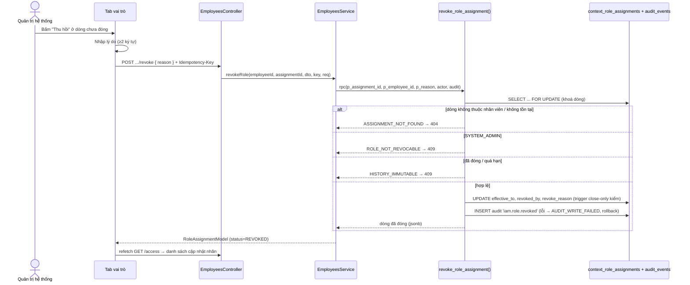

# UC-IAM-11 — Thu hồi vai trò theo location (kế hoạch kỹ thuật backend)

> Nối tiếp UC-IAM-10 (gán vai trò): dùng chung màn hình **Hồ sơ nhân viên → tab vai trò**, chung
> bảng `context_role_assignments` và chung bảng receipt idempotency. Thu hồi = **đóng hiệu lực**
> một dòng (không xoá, không sửa cột khác), đúng một lần.

## 1. Phạm vi

- Thêm route `POST /v1/employees/:id/role-assignments/:assignmentId/revoke` (SYSTEM_ADMIN, PLATFORM).
- Thêm RPC `revoke_role_assignment` (migration 11) đóng hiệu lực + ghi audit trong một transaction.
- Không đụng tới luồng gán (UC-IAM-10); không thêm module nghiệp vụ.

## 2. Luồng

## 3. Hợp đồng dữ liệu

`context_role_assignments` (migration 01): thu hồi chỉ được đặt `effective_to`, `revoked_by`,
`revoke_reason`. Trigger `tg_role_assignment_close_only` chặn xoá, chặn đóng lần hai, chặn sửa cột
khác và chặn **kéo dài** `effective_to`. Ràng buộc `ck_cra_effective_window` đòi
`effective_to >= effective_from`.

Thời điểm đóng: `v_end = greatest(now(), effective_from)`.
- Dòng **Đang hiệu lực** (effective_from ≤ now): đóng tại `now()`.
- Dòng **Sắp hiệu lực** (effective_from > now): đóng tại `effective_from` → dòng không bao giờ có
  hiệu lực, vẫn thỏa `ck_cra_effective_window` (UC-IAM-11.AC.1).
- Dòng **đã quá hạn** (effective_to ≤ now) hoặc **đã thu hồi**: chặn trước UPDATE với
  `HISTORY_IMMUTABLE` để không chạm luật "không kéo dài" của trigger (EX.1).

Idempotency: dùng chung `role_assignment_command_receipts`; migration 11 nới `operation` thêm
`'REVOKE'` và thêm cột `assignment_id`. Khóa gắn payload `(actor, employee, assignment_id, reason)`.

## 4. Guard / scope / audit

- Route kế thừa guard của `EmployeesController`: `JwtAuthGuard` + `PermissionsGuard` +
  `@RequireContext({ roles:[SYSTEM_ADMIN], contextType:PLATFORM })` (EX.5).
- RPC xác minh dòng thuộc đúng `p_employee_id` (chống IDOR giữa `:id` và `:assignmentId`).
- Audit `iam.role.revoked`: actor, lý do do người dùng nhập (không bịa — BR-AUD-03), context_type/id
  của dòng; ghi cùng transaction với việc đóng (BR-AUD-04 / EX.6).
- Throttle: `THROTTLE_WRITE`.

## 5. Ánh xạ lỗi (RPC → ErrorCode → HTTP)

| RPC raise | ErrorCode | HTTP | UC |
| --- | --- | --- | --- |
| `ASSIGNMENT_NOT_FOUND` | `REFERENCE_NOT_FOUND` | 404 | dòng lạ / IDOR |
| `ROLE_NOT_REVOCABLE` | `ROLE_NOT_REVOCABLE` | 409 | EX.3 |
| `HISTORY_IMMUTABLE` (tiền kiểm + trigger) | `HISTORY_IMMUTABLE` | 409 | EX.1 |
| `REASON_REQUIRED` | `REQUIRED_FIELD_MISSING` | 400 | EX.2 |
| `AUDIT_WRITE_FAILED` | `AUDIT_WRITE_FAILED` | 500 | EX.6 |
| `IDEMPOTENCY_IN_PROGRESS` | `REQUEST_TIMEOUT` | 408 | EX.7 |
| `IDEMPOTENCY_KEY_REUSED` | `VALIDATION_FAILED` | 400 | dùng lại key sai payload |

## 6. Kế hoạch test (TDD)

Unit (`employees.directory.spec.ts`):
- `revokeRole` chuyển đúng `assignmentId/employeeId/reason` xuống RPC.
- map dòng đã đóng → model `status = REVOKED`, `effectiveTo` set.
- lỗi RPC (vd `HISTORY_IMMUTABLE`) được truyền nguyên vẹn.
- `RevokeRoleAssignmentDto`: lý do trống/khoảng trắng → `REQUIRED_FIELD_MISSING`.

Smoke (`tools/smoke-employee-directory.mjs` mở rộng về sau nếu cần): happy-path đóng dòng + kiểm
EX.1 khi đóng lại.

## 7. Ngoài phạm vi GĐ1

- EX.4 (nhân viên còn chịu trách nhiệm tài sản tại location) phụ thuộc module tài sản (M06/M08) và
  câu hỏi mở Q-41 [TBD-2] — chưa chặn ở UC này.
- Cắt toàn bộ quyền khi khoá/nghỉ việc đi qua UC-IAM-12 / UC-IAM-13, không qua đây.
