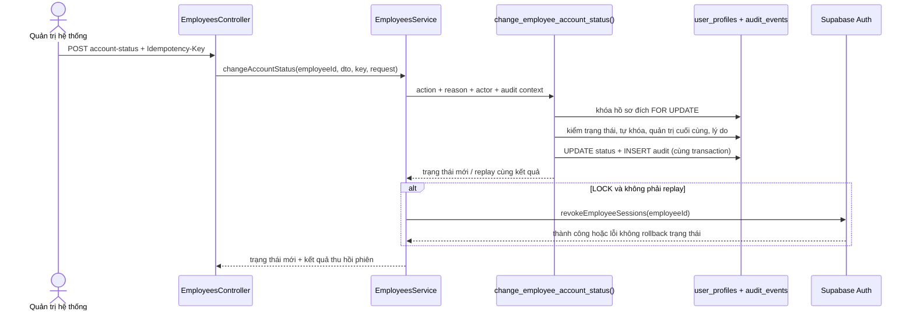

# UC-IAM-12 — Khóa hoặc mở khóa tài khoản (kế hoạch backend)

## 1. Phạm vi và hợp đồng API

- Mở rộng `GET /v1/employees/:id/access` để trả danh sách lý do đang hoạt động thuộc hai nhóm
  `ACCOUNT_LOCK` và `ACCOUNT_UNLOCK`.
- Thêm `POST /v1/employees/:id/account-status` (chỉ `SYSTEM_ADMIN`, phạm vi `PLATFORM`) với body
  `{ action: "LOCK" | "UNLOCK", reasonCodeId, reasonNote? }` và header `Idempotency-Key`.
- Kết quả trả hồ sơ tối thiểu `{ id, status, sessionRevocation: "SUCCEEDED" | "FAILED" | "NOT_REQUIRED" }`.
  `FAILED` chỉ có thể xảy ra khi **khóa**: trạng thái và audit đã commit, nhưng bước chủ động thu hồi
  phiên gặp lỗi; mọi request kế tiếp vẫn bị `JwtAuthGuard` chặn theo trạng thái hồ sơ.

## 2. Luồng transaction

## 3. Quy tắc bất biến

- Chỉ cho phép `ACTIVE → SUSPENDED` khi `LOCK`, `SUSPENDED → ACTIVE` khi `UNLOCK`; mỗi lần đổi
  thành công tăng `profile_version` để mọi biểu mẫu hồ sơ đang mở nhận xung đột thay vì ghi đè.
- Không được tự khóa chính mình. Không được khóa `SYSTEM_ADMIN` đang hoạt động cuối cùng. Hai chốt
  này nằm trong RPC và chạy dưới khóa hàng để tránh hai quản trị viên bị khóa đồng thời.
- Lý do phải tồn tại, đang hoạt động và đúng nhóm của hành động. Mục `is_freetext=true` bắt buộc có
  ghi chú; audit lưu nhãn lý do cùng ghi chú, không lưu một UUID khó đọc.
- Update trạng thái và ghi `iam.account.locked` / `iam.account.unlocked` trong cùng transaction;
  lỗi audit phải rollback update và trả `AUDIT_WRITE_FAILED`.
- Idempotency receipt khóa theo `(actor, employee, action, reasonCodeId, reasonNote)`. Replay không
  ghi audit lần hai và không gọi thu hồi phiên lần hai.
- RPC mới phải `revoke all ... from public, anon, authenticated`, chỉ `grant execute ... to service_role`.
- Migration mới là `12_lock_unlock_account.sql`; tuyệt đối không sửa migration 01–11 đã chạy.

## 4. Ánh xạ lỗi

| Trường hợp | ErrorCode | HTTP |
| --- | --- | --- |
| Nhân viên không tồn tại | `REFERENCE_NOT_FOUND` | 404 |
| Trạng thái không còn phù hợp hành động | `ACCOUNT_STATE_CONFLICT` | 409 |
| Tự khóa | `SELF_ACCOUNT_LOCK_FORBIDDEN` | 409 |
| Khóa quản trị hệ thống cuối cùng | `LAST_SYSTEM_ADMIN_REQUIRED` | 409 |
| Lý do thiếu/sai nhóm/ngừng dùng | `REASON_INVALID` | 400 |
| Ghi audit lỗi | `AUDIT_WRITE_FAILED` | 500 |
| Idempotency key đang xử lý | `REQUEST_TIMEOUT` | 408 |

## 5. TDD và kiểm chứng

1. Viết test đỏ cho DTO, service forwarding/mapping, tự khóa, lỗi RPC và semantics thu hồi phiên.
2. Viết migration 12, repository/controller/service vừa đủ làm test xanh.
3. Kiểm tra typecheck, eslint, toàn bộ Jest và build backend; review transaction, IDOR, idempotency,
   quyền execute và dữ liệu audit.

