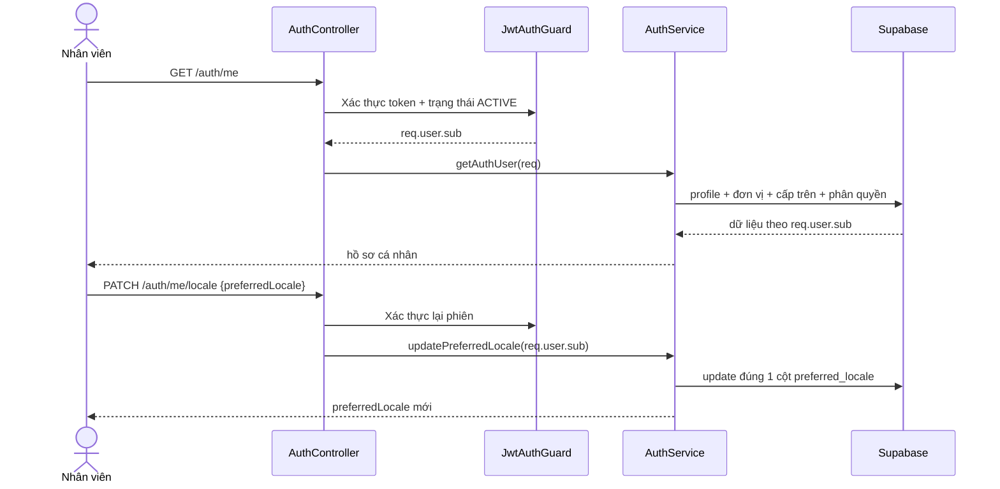

# UC-IAM-14 — Hồ sơ cá nhân và ngôn ngữ (Backend)

## Phạm vi

- Mở rộng `GET /v1/auth/me` để trả hồ sơ của đúng người trong phiên: thông tin liên hệ, công việc, cấp trên và các vai trò đang/sắp có hiệu lực.
- Thêm `PATCH /v1/auth/me/locale`, body chỉ có `preferredLocale: 'vi' | 'en'`.
- Không nhận `userId` từ client, không cho sửa trường nhân sự, không ghi audit và không tăng `profile_version` khi đổi ngôn ngữ.
- Không cần migration mới: `user_profiles.preferred_locale` và ràng buộc `vi|en` đã tồn tại.

## Luồng

## Hợp đồng dữ liệu

`GET /auth/me` giữ nguyên các trường phục vụ phiên hiện tại và bổ sung `jobTitle`, `phone`, `employmentType`, `location`, `department`, `manager`, `roleAssignments`. Mỗi vai trò có mã vai trò, loại/phạm vi, tên location nếu có, `effectiveFrom` và `effectiveTo`.

`PATCH /auth/me/locale` dùng DTO whitelist. Global validation pipe với `forbidNonWhitelisted` từ chối cả request nếu kèm tên, mã nhân viên hoặc trường lạ.

## Bảo mật và lỗi

- Cả hai route dùng `JwtAuthGuard`; guard từ chối tài khoản không còn ACTIVE.
- Chủ thể đọc/sửa luôn lấy từ `req.user.sub`.
- Không dùng response vai trò làm biên kiểm soát quyền; các API nghiệp vụ vẫn tự kiểm tra guard/scope.
- Lỗi xác thực, database và validation đi qua mapper/i18n hiện có.

## Kế hoạch TDD

1. RED: DTO chỉ nhận `vi|en`, từ chối trường thừa.
2. RED: service cập nhật đúng user trong phiên, đúng một cột và không audit/version.
3. GREEN: mở rộng query hồ sơ và ánh xạ role/location.
4. Regression: `/auth/me` cũ vẫn cung cấp `platformRoles` và `locationRoles` cho menu.
5. Chạy format, typecheck, eslint và toàn bộ Jest.

