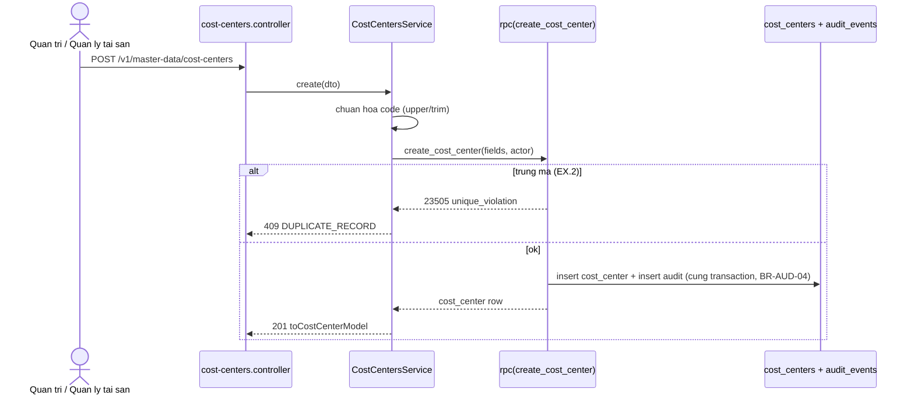

# Kế hoạch kỹ thuật backend — UC-MDM-03: Cập nhật danh mục cost center

> **Yêu cầu 2 (backend).** UC: [UC-MDM-03](../../product-usecase/M02-danh-muc-nen/UC-MDM-03_cap-nhat-danh-muc-cost-center.md). Tính năng F-MDM-03. Theo `/ecc:plan` + `tdd-workflow`. Cùng mẫu với [UC-MDM-01](../UC-MDM-01/README.md).
>
> **Trạng thái: CORE + AC.2 (kiểm location) đã dựng (tsc/eslint/test xanh).** Đã build tạo mới + sửa tên (luồng chính + AC.1) và **ngừng cost center (AC.2)** với kiểm "còn dùng" ở phần location (còn location ACTIVE dùng làm mặc định → `CATALOG_ITEM_IN_USE`). **Còn hoãn:** kiểm tài sản chưa kết thúc mang cost center (bảng tài sản M03 chưa có) — đã ghi chú `HOÃN` trong `02h` để bổ sung khi M03 xong.
>
> **Đã chạy:** `02d` + `02h_deactivate_rpc.sql` + `02g_reason_groups_22.sql` + `npm run gen:types`.

## 1. Endpoint và tầng
- `GET /v1/master-data/cost-centers?page&pageSize&status` — danh sách; `status=ACTIVE` cho ô chọn cost center của UC-MDM-01 (không lộ cost center đã ngừng).
- `POST /v1/master-data/cost-centers` — tạo mới (mã + tên).
- `PATCH /v1/master-data/cost-centers/:id` — sửa **tên**; mã chỉ đọc (BR-MDM-17, Giả định 2).
- Module `master-data`: `CostCentersController` → `CostCentersService` → `CostCenterRepository` (kế thừa `BaseRepository`) → `toCostCenterModel`.
- Guard: `@RequireContext({ roles: [SYSTEM_ADMIN, ASSET_MANAGER], contextType: PLATFORM })` (BR-CMN-03).

## 2. Sơ đồ trình tự (tạo cost center)

## 3. Điểm kỹ thuật chốt (từ UC)
- **Nguyên tử thay đổi + audit** (BR-AUD-04, EX.6): hàm Postgres `create_cost_center` / `update_cost_center` (migration 02d), cùng mẫu 02b.
- **Chuẩn hoá + duy nhất mã** (BR-MDM-01): upper/trim; unique toàn bảng (kể cả INACTIVE). Trùng → `DUPLICATE_RECORD` (409).
- **Khoá lạc quan** (EX.4): PATCH nhận `version`; không khớp → `RECORD_VERSION_CONFLICT` (409).
- **Mã bất biến sau tạo** (BR-MDM-17): PATCH chỉ sửa `name`.
- **Lọc status ở list**: ô chọn cost center chỉ lấy ACTIVE.
- **Model mapper**: `toCostCenterModel(row)` camelCase, `toIsoString` cho mốc thời gian.

## 4. Ngừng cost center (AC.2) — ĐÃ DỰNG (một phần kiểm "còn dùng")

- Endpoint `POST /v1/master-data/cost-centers/:id/deactivate` — body `{ reasonCodeId, note?, version }` (`DeactivateCostCenterDto`).
- Hàm `deactivate_cost_center` (migration `02h`): khoá dòng cost center `for update`, kiểm lý do ngừng còn hoạt động + thuộc nhóm `CATALOG_DEACTIVATE`, kiểm "còn dùng", lật `INACTIVE` + ghi audit `mdm.cost_center.deactivated` — tất cả trong một transaction (BR-AUD-04, UC-MDM-03 3f).
- Ai/khi/vì-sao của việc ngừng nằm ở `audit_events` (không thêm cột vào bảng); lý do = nhãn lý do đã chọn (+ ô ghi thêm khi 'Khác'), hàm tự dựng (BR-AUD-01).
- **Kiểm "còn dùng" (EX.3 `CATALOG_ITEM_IN_USE` 409):** còn location ACTIVE dùng cost center làm mặc định (BR-MDM-09) → chặn. ⚠️ **HOÃN:** kiểm tài sản chưa kết thúc mang cost center — bảng tài sản (M03) chưa có; ghi chú `HOÃN` trong `02h`, bổ sung khi M03 xong.
- Map lỗi: `REASON_INVALID`/`REASON_NOTE_REQUIRED` → `VALIDATION_FAILED` (400, EX.1); `VERSION_CONFLICT` → `RECORD_VERSION_CONFLICT` (409, EX.4); `CATALOG_ITEM_IN_USE` (409, EX.3).

## 5. Kế hoạch test (TDD — RED→GREEN)
- Unit (service với mock): chuẩn hoá mã; nhánh not-found → NOT_FOUND; truyền đúng version. ✅
- Ngừng (AC.2): not-found → NOT_FOUND (không gọi rpc); truyền `reasonCodeId` + `note` + `version` + diff trạng thái `ACTIVE→INACTIVE`. ✅ (`cost-centers.service.spec.ts`, 5 test xanh)
- Kiểm "còn dùng" + kiểm lý do đúng nhóm nằm trong RPC (SQL) — không unit-test được nếu không có DB thật; xác nhận qua smoke/manual.

## 6. Kiểm chứng trước khi báo xong
`npx tsc --noEmit` · `npx eslint src test` · `npm test`. Không commit (chờ Duy).
