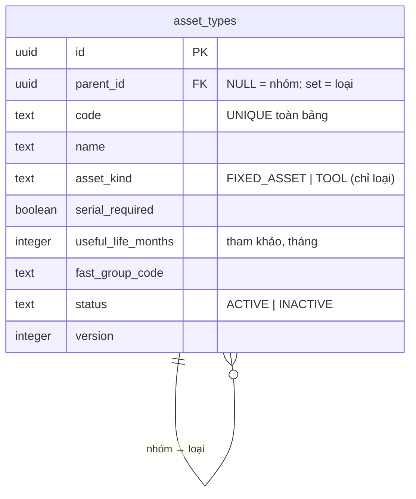

# Kế hoạch kỹ thuật backend — UC-MDM-04: Cập nhật cây loại tài sản

> **Yêu cầu 2 (backend).** UC: [UC-MDM-04](../../product-usecase/M02-danh-muc-nen/UC-MDM-04_cap-nhat-cay-loai-tai-san.md). Tính năng F-MDM-04. Cùng mẫu [UC-MDM-03](../UC-MDM-03/README.md).
>
> **Trạng thái: XONG (backend, tsc/eslint/test xanh).** Tạo/sửa/ngừng nhóm + loại. **Đã chạy:** `02i_asset_types.sql` + `02j_asset_type_rpc.sql` + `npm run gen:types`.

## 1. Mô hình dữ liệu — cây 2 cấp trong một bảng

Bảng `asset_types` tự tham chiếu `parent_id`:

- CHECK `asset_types_level_check`: nhóm (`parent_id NULL`) có `asset_kind NULL`; loại (`parent_id` set) bắt buộc `asset_kind`. Không lồng 3 cấp — kiểm ở RPC (cha phải là nhóm).
- Mã duy nhất toàn bảng, không dùng lại (BR-MDM-01). `version` cho khoá lạc quan.

## 2. Endpoint và tầng

- `GET /v1/master-data/asset-types?status` — danh sách phẳng (client dựng cây theo `parentId`).
- `POST /asset-types/groups` — tạo nhóm `{ code, name }`.
- `POST /asset-types` — tạo loại `{ parentId, code, name, assetKind, serialRequired?, usefulLifeMonths?, fastGroupCode? }`.
- `PATCH /asset-types/groups/:id` — sửa tên nhóm.
- `PATCH /asset-types/:id` — sửa loại (tên + cờ + serial + thời gian + mã FAST); mã + nhóm cha chỉ đọc.
- `POST /asset-types/:id/deactivate` — ngừng nhóm hoặc loại.
- `AssetTypesController` → `AssetTypesService` → `AssetTypeRepository` → `toAssetTypeModel`. Guard: `ASSET_MANAGER` + `SYSTEM_ADMIN`, PLATFORM.

## 3. Điểm kỹ thuật chốt

- **Tách RPC theo nhóm/loại** (`create_asset_type_group`/`create_asset_type`, `update_asset_type_group`/`update_asset_type`) để tránh truyền NULL qua rpc (supabase-js sinh tham số hàm non-null). Field optional của loại dùng **sentinel**: `usefulLifeMonths` gửi `0`, `fastGroupCode` gửi `''` → RPC đổi thành NULL.
- **Nguyên tử thay đổi + audit** (BR-AUD-04): mọi thao tác đi qua plpgsql (02j). Audit `mdm.asset_type.created/updated/deactivated`.
- **Tạo loại**: RPC kiểm nhóm cha tồn tại + ACTIVE + là nhóm → `PARENT_INVALID` (VALIDATION_FAILED, EX.1).
- **Ngừng** (AC.3): khoá dòng, kiểm lý do nhóm `CATALOG_DEACTIVATE`, **nhóm còn loại ACTIVE → `CATALOG_ITEM_IN_USE`** (EX.3). Trùng mã → `DUPLICATE_RECORD`; khoá lạc quan → `RECORD_VERSION_CONFLICT`.

## 4. Hoãn (chờ M03 — bảng tài sản)

- Ngừng **loại** phải kiểm không còn tài sản chưa kết thúc (BR-MDM-10, EX.3) → ghi chú `HOÃN` trong 02j.
- Đổi cờ TSCĐ/CCDC của loại **đã có tài sản** phải chặn (BR-MDM-06, EX.3) → `HOÃN`. Hiện chưa có tài sản nên cho đổi.

## 5. Kế hoạch test (TDD)

- Unit (service mock): chuẩn hoá mã + sentinel (thời gian 0 / mã FAST rỗng); not-found + guard nhóm-vs-loại → NOT_FOUND; version + cờ passthrough; deactivate diff trạng thái. ✅ (`asset-types.service.spec.ts`, 9 test).
- Kiểm nhóm cha + "còn dùng" nằm trong RPC (SQL) — xác nhận qua smoke/manual.

## 6. Kiểm chứng

`npx tsc --noEmit` · `npx eslint src test` · `npm test` (51/51). Không commit.
