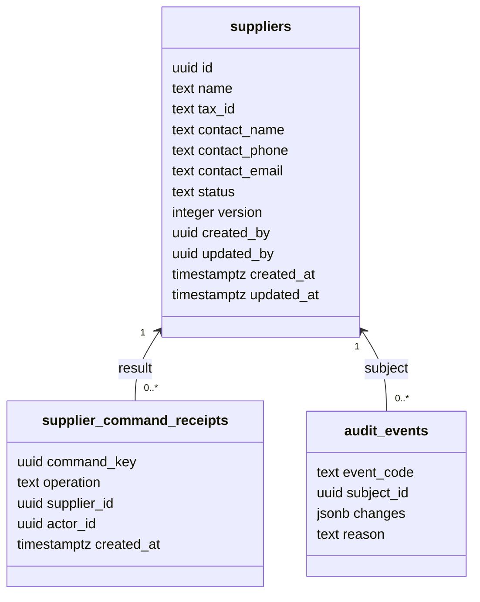
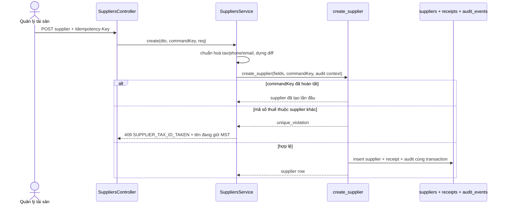
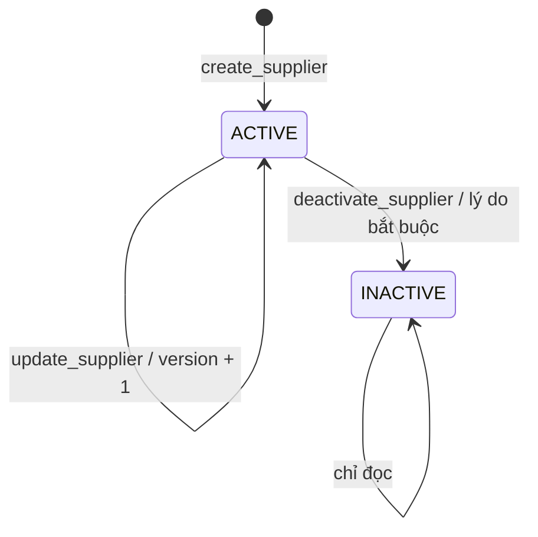

# Kế hoạch kỹ thuật backend - UC-MDM-05: Cập nhật danh mục nhà cung cấp

> **Yêu cầu 2 (backend).** UC: [UC-MDM-05](../../product-usecase/M02-danh-muc-nen/UC-MDM-05_cap-nhat-danh-muc-nha-cung-cap.md). Tính năng F-MDM-05. Kế hoạch theo `superpowers:writing-plans` + `ecc:tdd-workflow`, bám cấu trúc UC-MDM-03 (`cost-centers`).
>
> **Trạng thái:** Đã triển khai; migration 02k/02l/02m đã chạy; full test/build và DB RPC smoke đều xanh. Chờ manual test giao diện.

## 1. Phạm vi và quyết định dữ liệu

- Nhà cung cấp là danh mục toàn hệ thống, không theo location. Chỉ `SYSTEM_ADMIN` và `ASSET_MANAGER` được thao tác ở phạm vi `PLATFORM`.
- Trường nghiệp vụ: `name`, `tax_id`, `contact_name`, `contact_phone`, `contact_email`, `status`, `version` và các cột người/thời điểm tạo, cập nhật.
- Chỉ `name` bắt buộc. Tên được phép trùng. UC và blueprint không có mã nhà cung cấp, vì vậy không tự thêm trường `code` dù công thức chuyển giao có câu mô tả chung về chuẩn hoá mã.
- `tax_id` khi có phải là 10 chữ số hoặc `10 chữ số-3 chữ số`; duy nhất trên toàn bảng, kể cả dòng `INACTIVE`.
- Số điện thoại bỏ khoảng trắng, dấu chấm và gạch ngang; `+84` + 9 chữ số được đổi về `0` + 9 chữ số. Email trim và lowercase.
- Ngừng nhà cung cấp không xoá và không bị chặn bởi hồ sơ tài sản cũ. Lý do, người làm và thời điểm nằm trong `audit_events`, giống mẫu ngừng cost center.

## 2. Endpoint và phân tầng

| Endpoint | Hành vi |
| --- | --- |
| `GET /v1/master-data/suppliers?page&pageSize&status&query` | Phân trang phía server; tìm theo tên, MST hoặc liên hệ; `status=ACTIVE` phục vụ ô chọn ở M03 |
| `POST /v1/master-data/suppliers` | Tạo nhà cung cấp |
| `PATCH /v1/master-data/suppliers/:id` | Sửa tên, mã số thuế và người liên hệ, kèm `version` |
| `POST /v1/master-data/suppliers/:id/deactivate` | Ngừng với lý do nhóm `CATALOG_DEACTIVATE`, kèm `version` |

Luồng code: `SuppliersController` -> `SuppliersService` -> `SupplierRepository` -> RPC/PostgREST -> `toSupplierModel`.

Các file chính:

- `src/master-data/dto/supplier.dto.ts`
- `src/master-data/supplier.model.ts`
- `src/master-data/supplier.repository.ts`
- `src/master-data/suppliers.service.ts`
- `src/master-data/suppliers.controller.ts`
- `src/master-data/suppliers.service.spec.ts`
- `sql-docs/migrations/02k_suppliers.sql`
- `sql-docs/migrations/02l_supplier_rpc.sql`

## 3. Sơ đồ dữ liệu

`supplier_command_receipts` là bảng kỹ thuật tối thiểu để đáp ứng EX.6/QĐ-01. Receipt được ghi trong cùng transaction với supplier và audit; gửi lại cùng `command_key` trả kết quả đã có, không ghi audit lần hai. Bảng bật RLS deny-by-default và không phải lịch sử nghiệp vụ.

## 4. Luồng tạo và chống gửi trùng

## 5. Luồng sửa/ngừng và trạng thái

- `update_supplier` và `deactivate_supplier` khoá dòng, kiểm receipt trước, rồi kiểm `version`. Lệch phiên bản trả `RECORD_VERSION_CONFLICT`.
- `deactivate_supplier` kiểm lý do còn `ACTIVE`, đúng nhóm `CATALOG_DEACTIVATE`; mục "Khác" bắt buộc có `note`.
- Không có `CATALOG_ITEM_IN_USE` cho supplier vì UC-MDM-05 Giả định 5 cho phép ngừng dù hồ sơ cũ đang tham chiếu.
- Audit dùng `mdm.supplier.created`, `mdm.supplier.updated`, `mdm.supplier.deactivated`; `diffFields` chỉ gồm trường thực sự thay đổi.

## 6. Migration và biên bảo mật

- `02k_suppliers.sql`: bảng, CHECK độ dài/định dạng, unique index cho `tax_id is not null`, trigger `tg_set_updated_at`, RLS deny-by-default, bảng receipt.
- `02l_supplier_rpc.sql`: ba RPC nguyên tử. Không sửa migration 02i/02j đã chạy.
- Đăng ký `SupabaseTable.SUPPLIERS`; thêm types tay theo đúng thứ tự nếu schema live chưa có, sau khi Duy chạy migration dùng `npm run gen:types` để ghi lại type thật.
- Controller dùng `JwtAuthGuard`, `PermissionsGuard`, `@RequireContext({ roles: [SYSTEM_ADMIN, ASSET_MANAGER], contextType: PLATFORM })` và `THROTTLE_WRITE`.
- Credential chỉ đọc từ env; audit không chứa token hay dữ liệu ngoài allow-list.

## 7. Ánh xạ lỗi

| Điều kiện | Mã API |
| --- | --- |
| DTO/định dạng/lý do sai | `VALIDATION_FAILED` 400 |
| Mã số thuế đã thuộc supplier khác | `SUPPLIER_TAX_ID_TAKEN` 409, thông báo có tên supplier đang giữ |
| Dòng không tồn tại | `NOT_FOUND` 404 |
| Version cũ | `RECORD_VERSION_CONFLICT` 409 |
| Không đủ vai trò | `ROLE_REQUIRED` 403 |
| Ghi audit thất bại | `AUDIT_WRITE_FAILED` 500, toàn transaction rollback |
| Quá thời gian | `REQUEST_TIMEOUT` 408; retry dùng lại command key |

## 8. Kế hoạch TDD

1. RED service: tạo mới chuẩn hoá điện thoại/email/tax ID và truyền `commandKey` vào RPC.
2. GREEN tối thiểu: DTO/model/service/repository interface đủ cho test.
3. RED service: update không tìm thấy, truyền version và diff đúng các trường đổi.
4. GREEN: update flow.
5. RED service: deactivate truyền lý do, note, version và diff `ACTIVE -> INACTIVE`.
6. GREEN: deactivate flow.
7. RED repository/controller: map duplicate/version/reason và bắt buộc UUID `Idempotency-Key` cho ba lệnh ghi.
8. GREEN: repository/controller/module/audit registry/table registry.
9. SQL được kiểm bằng smoke thật sau khi migration chạy: create, retry cùng key, duplicate tax ID, update, version conflict, deactivate và retry.

## 9. Kiểm chứng và cổng dừng

- Backend: `npm run format && npx tsc --noEmit && npx eslint src test && npm test`.
- Runtime: health cổng 3006 và `node tools/smoke-supplier-rpc.mjs` (create/replay, trùng MST, update/replay, stale version, deactivate/replay, đúng 3 audit) đều xanh với credential từ env.
- Cập nhật `sql-docs/README.md`, nhật ký tiến độ và trạng thái tài liệu này bằng output thật.
- Không commit. Còn manual test UC-MDM-05; theo chỉ đạo mới tiếp tục UC-MDM-06 trong cùng phiên.
