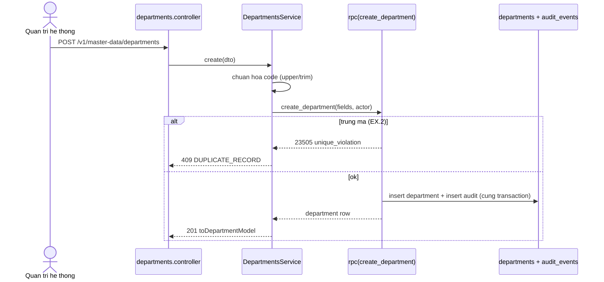

 # Kế hoạch kỹ thuật backend — UC-MDM-08: Cập nhật danh mục phòng ban

> **Yêu cầu 2 (backend).** UC: [UC-MDM-08](../../product-usecase/M02-danh-muc-nen/UC-MDM-08_cap-nhat-danh-muc-phong-ban.md). Tính năng F-MDM-08. Cùng mẫu [UC-MDM-03](../UC-MDM-03/README.md).
>
> **Trạng thái: CORE đã dựng (tsc/eslint/test xanh).** Tạo mới + sửa tên (luồng chính + AC.1). **Chưa dựng** (chờ phụ thuộc): gán trưởng phòng, ngừng phòng ban (AC.2), `CATALOG_ITEM_IN_USE` (EX.3).
>
> **Cần chạy runtime:** `migration 02e_department_rpc.sql` + `npm run gen:types` (đã chạy).

## 1. Endpoint và tầng
- `GET /v1/master-data/departments?page&pageSize&status`
- `POST /v1/master-data/departments` — tạo mới (mã + tên).
- `PATCH /v1/master-data/departments/:id` — sửa **tên**; mã chỉ đọc (BR-MDM-17).
- Module `master-data`: `DepartmentsController` → `DepartmentsService` → `DepartmentRepository` → `toDepartmentModel`.
- Guard: `@RequireContext({ roles: [SYSTEM_ADMIN], contextType: PLATFORM })` — **chỉ SYSTEM_ADMIN** (khác location/cost center có thêm ASSET_MANAGER; UC-MDM-08 không có tác nhân phụ).

## 2. Sơ đồ trình tự (tạo phòng ban)

## 3. Điểm kỹ thuật chốt
- Nguyên tử thay đổi + audit qua `create_department`/`update_department` (02e). Chuẩn hoá + duy nhất mã (BR-MDM-14). Khoá lạc quan `version` (EX.4). Mã bất biến (BR-MDM-17). Lọc `status` ở list.
- Model `toDepartmentModel` trả `managerId` (hiện luôn null cho tới khi có luồng gán trưởng phòng).

## 4. Chưa dựng (chờ phụ thuộc)
- **Gán/đổi trưởng phòng (manager_id)** + kiểm BR-MDM-07 (trưởng phòng phải là nhân viên Đang hoạt động): cần danh sách nhân viên (UC-IAM-15) — chưa có.
- **Ngừng phòng ban (AC.2)** + **EX.3 `CATALOG_ITEM_IN_USE`**: cần danh mục lý do (UC-MDM-07) và đếm nhân viên theo phòng ban (`user_profiles.department_id`, thuộc M01/UC-IAM-05).

## 5. Kế hoạch test (TDD)
- Unit (service mock): chuẩn hoá mã; not-found → NOT_FOUND; truyền đúng version. ✅ (`departments.service.spec.ts`, 3 test).
- Smoke + seed: `tools/smoke-master-data.mjs` (tạo phòng ban mẫu + đối chiếu listing).

## 6. Kiểm chứng
`npx tsc --noEmit` · `npx eslint src test` · `npm test`. Không commit.
